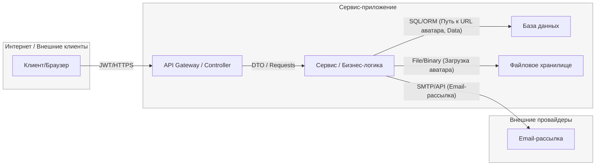

# S04 - DFD (Data Flow Diagram)

```mermaid
flowchart LR
  subgraph Internet[Интернет / Внешние клиенты]
    U[Клиент/Браузер]
  end

  subgraph Service[Сервис-приложение]
    A[API Gateway / Controller]
    S[Сервис / Бизнес-логика]
    D[База данных]
    S3[Файловое хранилище]
  end

  subgraph External[Внешние провайдеры]
    X[Email-рассылка]
  end

  U -- "JWT/HTTPS" --> A
  A -->|"DTO / Requests"| S
  S -->|"SQL/ORM (Путь к URL аватара, Data)"| D
  S -->|"SMTP/API (Email-рассылка)"| X
  S -->|"File/Binary (Загрузка аватара)"| S3

  classDef boundary fill:#f6f6f6,stroke:#999,stroke-width:1px;
  class Internet,Service,External boundary;
```
